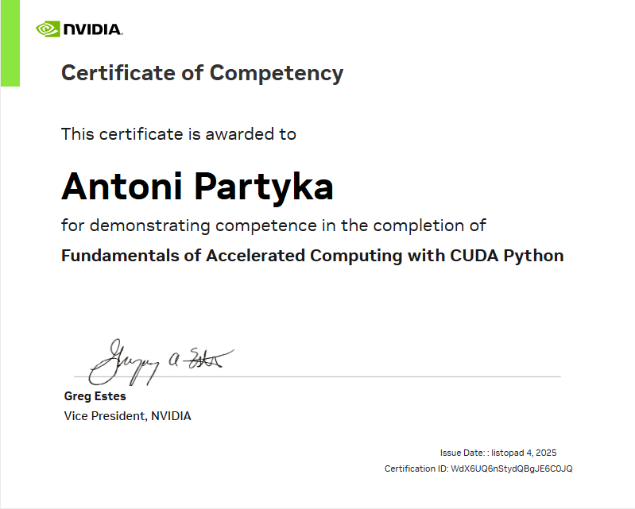

# Moje Kursy i Certyfikaty

## Spis treści
- [NVIDIA](#nvidia)
- [Coursera](#coursera)

---

## NVIDIA

### 1. Fundamentals of Accelerated Computing with CUDA Python  
[Zobacz kurs](https://learn.nvidia.com/courses/course-detail?course_id=course-v1:DLI+S-AC-10+V1)  
**Status:** Ukończony  
**Data ukończenia:** 04.11.2025  
**Technologie:** CUDA, Python, Numba  

### 2. Introduction to Transformer-Based Natural Language Processing  
[Zobacz kurs](https://learn.nvidia.com/courses/course-detail?course_id=course-v1:DLI+S-FX-08+V1)  
**Status:** W trakcie  
**Data ukończenia:** brak  
**Technologie:** Generative AI, LLM, Python

---

## Coursera

### 1. Java Basics: Selection and Iteration
[Zobacz kurs](https://www.coursera.org/learn/codio-java-basics)    
**Status:** W trakcie  
**Data ukończenia:** brak  
**Tematy:** Java, Selection, Iteration
